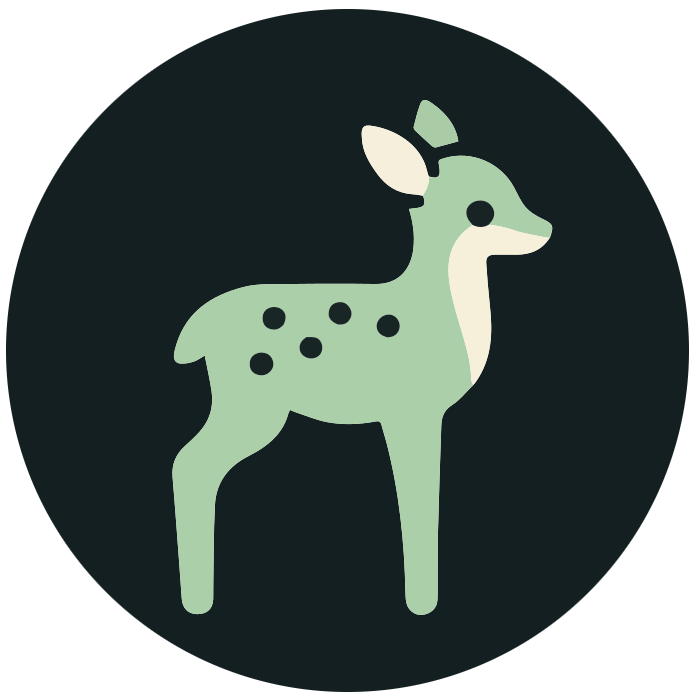

 

  <h3 align="center">FawnRescue</h3>
  

    Frontend App 
    

  
  
  

    

    <a href="https://github.com/FawnRescue/frontend/issues">Report Bug</a>
    ·
    <a href="https://github.com/FawnRescue/frontend/issues">Request Feature</a>
    

    <a href="https://fawnrescue.github.io/">Website</a>
  

## Overview
This is a Kotlin Multiplatform project for the mobile app of the FawnRescue project targeting Android, iOS, Desktop.

* `/composeApp` is for code that will be shared across your Compose Multiplatform applications.
  It contains several subfolders:
  - `commonMain` is for code that’s common for all targets.
  - Other folders are for Kotlin code that will be compiled for only the platform indicated in the folder name.
    For example, if you want to use Apple’s CoreCrypto for the iOS part of your Kotlin app,
    `iosMain` would be the right folder for such calls.

* `/iosApp` contains iOS applications. Even if you’re sharing your UI with Compose Multiplatform, 
  you need this entry point for your iOS app. This is also where you should add SwiftUI code for your project.

Learn more about [Kotlin Multiplatform](https://www.jetbrains.com/help/kotlin-multiplatform-dev/get-started.html)…

The app allows its users to:
- Login to FawnRescue
- Add and edit Missions
- Add and edit Flight Dates
- Create Flight Plans for a Mission
- Connect to a Drone
- Control a Drone during a active Flight Date
- View Fawn detections 

# Setup
1. Configure a supabase project online based on the fawnrescue/backend repository.
1. Open the project in Android Studio
3. Create a file `secrets.properties` based on the template
1. if there are problems with the iosX64() library import set `repositoriesMode.set(RepositoriesMode.FAIL_ON_PROJECT_REPOS)`
1. For the Google Maps API to work you need to either use our debug.keystore in ~/.android/ or apply for access yourself
